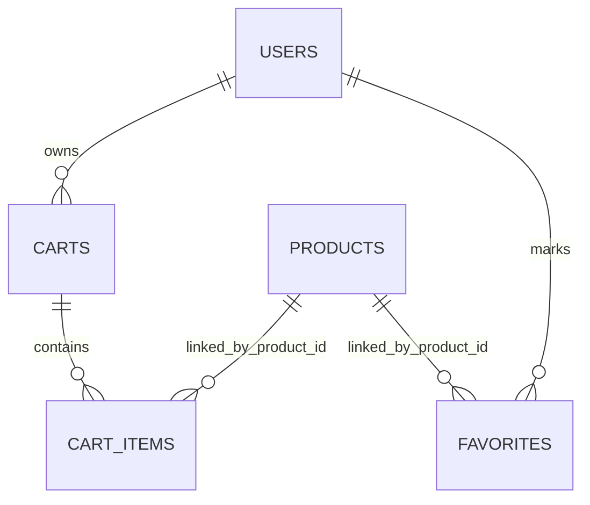

## 1. Stack

- `PostgreSQL` is the primary backend database.
- `Spring Data JPA` manages entities and repositories.
- `SQLite (sqflite)` is used in Flutter as an offline cache (`local_database_service.dart`).

## 2. Logical ER Model

## 3. Main Tables

| Table | Key fields |
| --- | --- |
| `users` | `id`, `username`, `email`, `password`, `role`, `name` |
| `products` | `id`, `name`, `description`, `price`, `quantity`, `category`, `image`, `rating`, `created_at`, `updated_at`, `in_stock` |
| `favorites` | `id`, `user_id`, `product_id` |
| `carts` | `id`, `user_id` |
| `cart_items` | `id`, `cart_id`, `product_id`, `quantity` |

## 4. Data Operations

- Products: full CRUD with filtering/sorting (`ProductService`, `ProductSpecifications`).
- Favorites: add/remove product by `userId + productId` (`FavoriteService`).
- Cart: add/update/remove items and calculate total (`CartService`).
- Users: register/login/profile update/password change/role change.

## 5. Validation and Errors

- DTO validation uses `jakarta.validation` annotations.
- `GlobalExceptionHandler` returns unified error response:
  `{ status, message, details, timestamp }`.
- Common statuses:
  - `400` invalid input
  - `401` missing or invalid token
  - `403` forbidden action (RBAC/user mismatch)
  - `404` not found
  - `409` conflict (email/username already exists)

## 6. Security and Access Rules

- JWT is used for authentication.
- Role-based checks:
  - Product write operations (`POST/PUT/DELETE`) are `ADMIN` only.
  - User role update endpoint is `ADMIN` only.
- User isolation checks:
  - Cart and favorites endpoints verify `path userId == token userId`.

## 7. Seed Data

- Admin seed:
  - Enabled by `APP_ADMIN_SEED_ENABLED=true`.
  - Configurable by `APP_ADMIN_EMAIL`, `APP_ADMIN_PASSWORD`, `APP_ADMIN_USERNAME`.
- Product seed:
  - Enabled by `APP_PRODUCTS_SEED_ENABLED=true`.
  - Inserts demo products only when `products` table is empty.

## 8. Flutter Offline Cache

- Local SQLite tables: `products`, `cart_items`, `favorites`.
- App behavior:
  - On successful sync, data is cached.
  - On network failure, catalog/cart/favorites are loaded from local cache.
