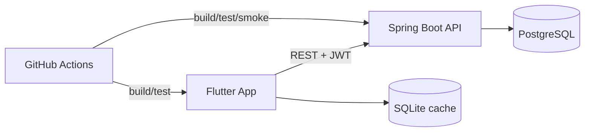

## Defense Pack

### 1. Goals and Relevance

- Goal: build a production-style mobile e-commerce app with secure backend APIs, role-based access, offline-friendly UX, and reproducible deployment/testing.
- Relevance: combines practical mobile + backend engineering skills (Flutter, Spring Boot, PostgreSQL, Docker, CI) required in real product teams.

### 2. Architecture Snapshot

### 3. Backend Rubric Mapping

| Criterion | Status | Evidence |
| --- | --- | --- |
| 1.1 Registration/Auth | Done | `Bэckend/src/main/java/com/echoes/flutterbackend/controller/UserController.java` |
| 1.2 RBAC admin/user | Done | `Bэckend/src/main/java/com/echoes/flutterbackend/config/SecurityConfig.java`, `Bэckend/src/test/java/com/echoes/flutterbackend/SecurityIntegrationTests.java` |
| 1.3 Search/filter/sort | Done | `Bэckend/src/main/java/com/echoes/flutterbackend/controller/ProductController.java` |
| 1.4 CRUD | Done | Product/cart/favorites controllers/services |
| 1.5 DB persistence | Done | JPA repositories/services + tests |
| 1.6 Clear error messages | Done | `Bэckend/src/main/java/com/echoes/flutterbackend/exception/GlobalExceptionHandler.java` |
| 1.7 Dynamic UI updates | Done | Flutter GetX controllers/views (`lib/app/modules/**`) |
| 1.8 Password reset/profile edit | Done | `/forgot-password`, `/reset-password`, `/me`, `/me/password` |
| 1.9 Centralized exceptions/logging | Done | `GlobalExceptionHandler` |
| 1.10 Multi-level logging | Done | INFO/WARN/ERROR in handlers/services/tests logs |
| 1.11 REST principles | Done | GET/POST/PUT/DELETE across API |
| 1.12 Seed/demo mode | Done | env-based admin/product seed in backend config |
| 2.x Interface/UX | Done | Flutter UI modules + responsive setup in `lib/main.dart` |
| 3.x Testing | Done | `Bэckend/src/test/java/**`, `test/**`, `integration_test/**` |
| 4.x Docker | Done | `Bэckend/Dockerfile`, `Bэckend/docker-compose.yml` |
| 5.x Git | Done | commits, branches, remote, CI |
| 6.x DB/security | Done | JPA (no raw SQL), RBAC, BCrypt password hashing |
| 7.x Defense prep | Done (docs) | this file + `docs/api.md`, `docs/testing.md`, `docs/database.md`, `docs/project_overview.md` |

### 4. Extended Criteria Mapping

| Area | Status | Notes |
| --- | --- | --- |
| REST API + auth | Done | JWT + documented endpoints |
| Response parsing/errors/timeouts | Done | `lib/app/data/services/api_client.dart` |
| WebSocket/realtime | Done | `ws://localhost:8080/ws/products`, auto-refresh in `HomeController` |
| GraphQL | Not implemented | optional next extension |
| FTP/SFTP | Not implemented | optional next extension |
| Network logging/monitoring | Partial | server logs + actuator health; no external APM |
| Server-client contracts | Done | `docs/api.md`, DTO validation |
| DB operations/transactions | Done | transactional services |
| Core function correctness/stability | Done | service + integration tests |
| Retries/fallbacks | Partial | client retry/timeout; no circuit breaker |
| Push/notifications | Partial | UI placeholders; full push pipeline not included |
| Backend docs/endpoints | Done | Swagger + docs folder |
| Test deploy + Docker + CI/CD | Partial | CI + docker smoke done; no production deploy stage |
| Mobile unit tests | Done | `test/forgot_password_controller_test.dart` |
| Mobile integration tests | Done (basic) | `integration_test/auth_flow_integration_test.dart` |
| Automated UI tests (Driver/Appium) | Partial | `integration_test` available; Appium not configured |
| Test analysis/report | Done | `docs/testing.md` |
| Cross-platform device report | Partial | manual matrix can be added before defense |
| Clean architecture/maintainability | Done | modular Flutter + service/repository backend |
| Performance/data loading optimization | Partial | local cache + paging/filtering present |
| Scalability/maintainability | Done | CI, docs, transactional boundaries, validation |

### 5. Demo Scenario for Commission

1. Start with `docker compose up --build -d` in `Bэckend`.
2. Show `GET /actuator/health` and Swagger (`/swagger`).
3. Register/login as USER, show product browse.
4. Show USER blocked on `POST /api/v1/products` (`403`).
5. Login as ADMIN, create product successfully.
6. In mobile app: edit profile, change password, forgot-password token flow.
7. Keep Home screen open and create/update/delete product as ADMIN to show realtime WebSocket updates.
8. Show test evidence: backend tests, flutter tests, CI checks.
